# Diaspora Society Banking Model

[View the project here](https://diaspora-society-850f7c18f583.herokuapp.com/)

Banking is one of the biggest beneficiaries of information technology. In the past it it used to take 10 days to transfer money from one country to another but now it takes less than 10 minutes to achieve the same. At the same time the world has been turned into a global village. Each country has now a large diaspora community - A diaspora is a group of people who don't live in their original country but still maintain their heritage in the new country.

The diaspora communities involve in their small or large group building society, burial society, credit society. To carry these activities many small diaspora communities keep their financial records on simple spreadsheet without full transparence to members. This is a source of disagreement which leads to un unhappy ending of those groups. The original goal is good but money accountabily breaks these societies.

This diaspora society banking model is a simple application these groups can adopt and model it to their special need. In short the Diaspora Society banking model is a command line application to manage small clubs banking needs or just use it as a financial record for its members and help to clear the disagreements.

The application allows users to create banking accounts, deposit money, withdraw money, check their balance, remove users from groups, transfer money among users and check final records of the group or club.

Depending with group for this model the data can be stored on a local computer or on a Google sheet. For demonstration I have included a local storage. Since these groups might have no one with strong information technology skill the demonstration uses local strorage to the prefered Google sheet. This application will be used to teach kids about banking so it must be simple that the kids understand. The full banking can be applied for large groups.

## Table of Contents
* [User Exprience ](#user-experience)
* [Features](#features)
* [Design](#design)
* [Technologies Used](#technologies-used)
* [Testing](#testing)
* [Deployment](#deployment)
* [Credits](#credits)

## User Experience

### User Stories

* #### First Time User Goals
    * As a first time user, I want to see what can I benefit from the application
    * As a first time user, I want to navigate throughout the application easily
    * As a first time user, I want to find short, reliable and accurate information
    * As a first time user, I want to learn how to use the application quickly
    * As a first time user, I want to be able to apply what the application offer

* #### Returning User Goals
    * As a returning user, I want to find more helpful information
    * As a returning user, I want to find how I can interact with the application to full maximise its purpose.
    * As a returning user, I want to view other new options added to the diaspora society banking application.
    * As a returning user, I want to view helpful prompts and alerts when adding or updating accounts options.
    * As a returning user, I want to view latest capturing of my data using little effort on my part cloud database.

* ### Frequent User Goals
    * As a frequent user, I want to see more and new data capturing methods.
    * As a frequent user, I want to see new additions which benefit the users.

## Features

### Existing Features

- ###  __Diaspora Society Banking Model Flowchart__
    - The Diaspora Society banking model follow a simple day to day banking as shown in the flowchart below

        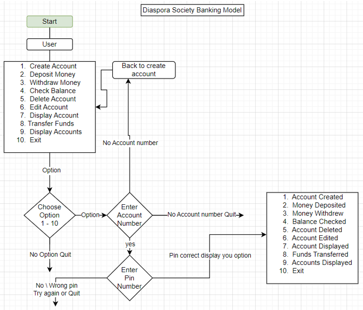 

- ###  __1 Main Menu__
    - The main menu is displayed when the application starts. The menu is divided into 10 options, namely Create Account, Deposit Money, Withdraw Money, Check Balance, Delete Account, Edit Account, Display Account, Transfer Funds, Display All Accounts and Exit

    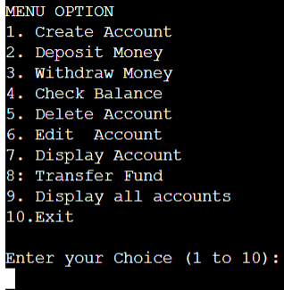    
    
    - The user is prompted to choose one of the menu options by entering the option number. Menu option 1 Create Account show below figure

    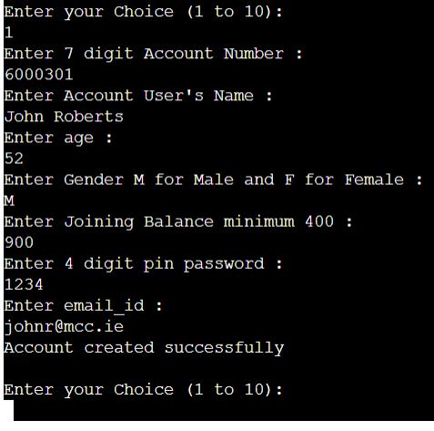

    
    - The main menu is repeatedly refreshed and re-displayed while inputs from the user are valid this is for easy accessibility of the user main menu, no need to scroll to find the menu options

        - In the above main menu when the user is prompted to choose one of the menu options by entering the option number an error can occur if a number outside 1 to 10 is entered.  If the user enters an incorrect value an error message is displayed

    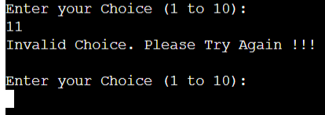

- ###  __Main Menu Option 1 Create Account Error Input__

    - If the user enters an incorrect value an error message is displayed. During Create Account 6 fields are populated namely account number, account user,age, gender, joining balance, pin number and email. Below are screen shot of each field wrongly entered.
    
    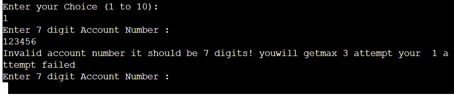

    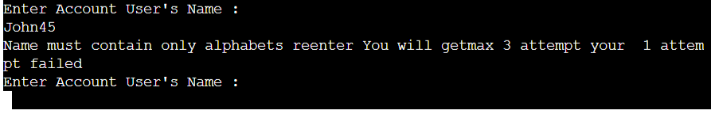

    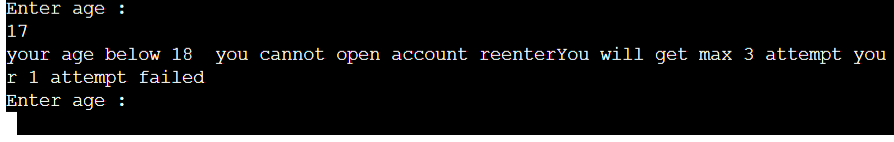

    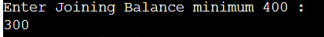

    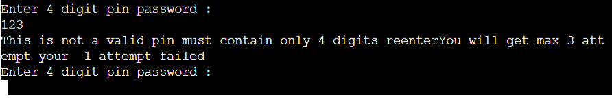

- ###  __2 Deposit Money__

    - If the user selects from Menu Option 2 Deposit Money, the user can deposit a minimum of 40 euros and gets confirmation of amount deposited.

        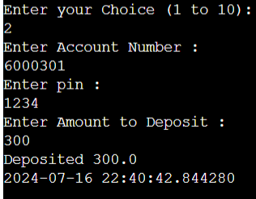

- ###  __3 Withdraw Money__

    - If the user selects from Menu Option 3 Withdraw Money, the user can withdraw a minimum of over 40 euros and gets confirmation of amount withdrawn.

        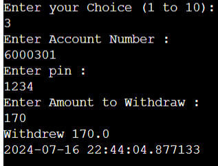

- ###  __4 Check Balance__

    - If the user selects from Menu Option 4 Check Balance, the user can check the balance.

        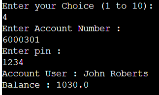

- ###  __5 Delete Account__

    - If the user selects from Menu Option 5 Delete Account, the user can check the balance.

        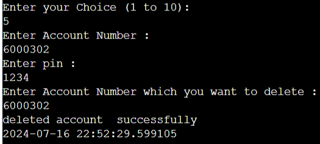

- ###  __6 Edit Account__

    - If the user selects from Menu Option 6 Edit Account, the system can edit personal details, when someone is married and want to change surname or someone who wants to change name.

        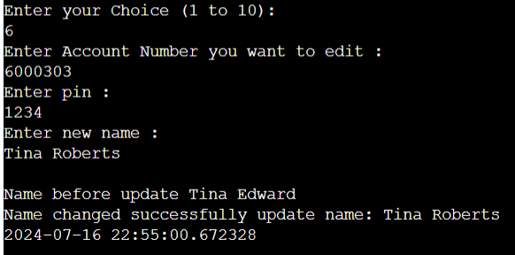

- ###  __7 Display Account__

    - If the user selects from Menu Option 7 Display Account, the user can display a user's account details to just confirm the details or after editing to just confirm changes.

        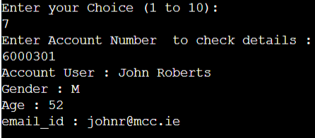

- ###  __8 Transfer Funds__

    - If the user selects from Menu Option 8 Transfer Funds, the user can transfer funds from one account number to another account number.

        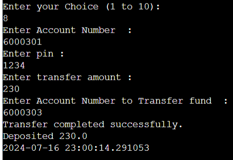

- ###  __9 Display All Accounts__

    - If the system selects from Menu Option 9 Display All Accounts, the system can view all accounts details. The focus of this model application did not focus on the storage despite including a Google Sheet and local storage. This is just used for teaching kids and seniors with very little information technology. There are now easier storage modules so this section is left for the future when also banking technology is on the forefront of the diaspora society banking system

        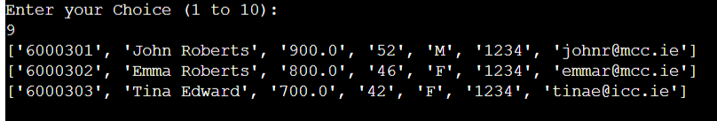

 ### Future Features

* Diaspora Society Banking Model
    * Apart from helping with day to day banking, the banking application make the groups involved to add members in boardering countries. The bigger the group the more power they have.
    * This application will have all features in the future to cover data protection, fraud and full security features.
    * The current version because of the time factor to complete it does not address all feature required that is why the purpose is more of a demo version.
    * In the future everyone can use it, it will come with special prepopulated option for different kind of Diaspora groups.

## Technologies Used

### Languages Used

-   Python 
-   Frameworks 
-   Libraries & Programs Used

## Testing

### Browser Compatibility

* Testing carried on these browsers
    * Chrome
    * Edge

* Feature Testing

| Feature            | Steps                                         | Outcome                                   | Results|
| -------------------| ----------------------------------------------| ------------------------------------------| -------|
|Create Account      |Enter option 1 input valid and invalid values  |Error and succesful result as expected     | Pass   |
|Deposit Money       |Enter option 2 input invalid and valid values  | Error and sucessful result as expected    | Pass   |
|Withdraw Money      |Enter option 3 input invalid and valid values  |Error and sucessful results as expected    | Pass   |
|Check Balance       |Enter option 4                                 |User balance is shown on screen            | Pass   |
|Delete Account      |Enter option 5                                 |User account choosen deleted               | Pass   |
|Edit Account        |Enter option 6 input new name                  |Old name edited and new name displayed     | Pass   |
|Display Account     |Enter option 7 input account and pin           |Account number details displayed           | Pass   |
|Transfer Funds      |Enter option 8 input the two accounts numbers  |Funds transferred confirmed                | Pass   |
|Display All Accounts|Enter option 9                                 |User accounts displayed                    | Pass   |
|Account Number      |Enter non 7 digit and 7 digit number           |Show error and pass as expected            | Pass   |
|Account Name        |Add numerical to the name                      |Throughs error as expected                 | Pass   |
|Account Pin         |Enter 4 digit pin and non 4 digit pin          |Pass and fail result as expected           | Pass   |

## Testing

### Validator Testing

- [Python Validator](http://pep8online.com/)

    - result for `run.py` with errors.

      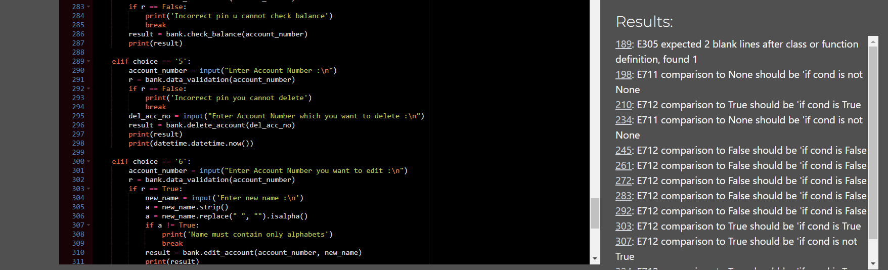

    - result after errors cleared for CI Python Linter

      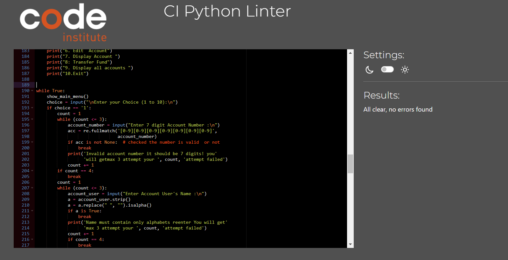

## Deployment

### Create Repository

1. Link to the [Python Essentials Template](https://learn.codeinstitute.net/courses/course-v1:CodeInstitute+LS101+1/courseware/293ee9d8ff3542d3b877137ed81b9a5b/e3b664e16366444c8d722c5d8340b340/).
2. Click green button "Use this template", then "Create a new repository".
3. Enter repository name and click "Create repository".

### Clone my repository from GitHub to VSCode

1. Click green button "<> Code" in my repository on GitHub.
2. On the "HTTPS" tab, click on the clipboard icon to copy the URL.
3. In the VSCode app enter CTRL+SHIFT+G, then click "Clone repository" and paste the link.
4. Throughout development I used such git commands:
   - git add: to add the file(s) to the staging area before they are committed;
   - git commit -m “commit message”: to commit changes to the local repository queue, ready for the final step;
   - git push: to push all committed code to the remote repository on GitHub.

### Creating the Heroku app

This project was deployed using Code Institute's mock terminal for Heroku. Below are the steps I followed to be able to deploy the terminal to the website:

1. Create a new Heroku app on the Heroku website.
2. Create config vars:
   - on the _Settings_ tab click "Reveal Config Vars";
   - in the field for key enter "CREDS", all capital letters;
   - copy the entire creds.json file from our workspace and paste it into the value field;
   - click “Add”;
   - add another config var, key "PORT" and set this to "8000".
3. Add two buildpacks from the _Settings_ tab. The ordering is as follows:
   - `heroku/python`
   - `heroku/nodejs`
4. Connect the Heroku app to the repository on GitHub.
5. Enter the name repository, click Search and click Connect.
6. Click Deploy Branch.

## Credits

    The Code Institute Learning Platform, Learning Management System (LMS) was the main basis of my codes for this project. A number of my codes is based from the Love Sandwhiches Project.

    Thanks to Amy Richardson for the resources she gave us during the course of this project.

    Thanks to my mentor Brian Macharia for his mentoring sessions, guidance, patience, encouragement and constant motivation throughout the project.

    Thanks to the tutors whom I get help ans support during the project. Special mentioning Alan and Rebecca for their knowledge sharing skills, patience and quick response.

### Content
Object Oriented Programming in Python by Estefania Cassingena Navone (https://www.udemy.com/course/python-object-oriented-programming-oop/learn/lecture/12356228?start=150#overview)

Python Masterclass 2024: Build 24 Real World Python Projects by Ashutosh Pawar (https://www.udemy.com/course/python-masterclass-course/learn/lecture/37365778?start=105#overview)

100 Days of Code: The Complete Python Pro Bootcamp
 by Dr. Angela Yu (https://www.udemy.com/course/100-days-of-code/learn/lecture/20628484?start=60#overview)

Python 3: Deep Dive (Part 3 - Dictionaries, Sets, JSON)
 by Dr. Fred Baptiste (https://www.udemy.com/course/python-3-deep-dive-part-3/learn/lecture/12049204?start=615#overview)

Google Sheets - The Comprehensive Masterclass by Leila Gharani
 (https://www.udemy.com/course/google-sheets-masterclass/learn/lecture/22289746#overview)

Python Mega Course: Learn Python in 60 Days, Build 20 Apps by Ardit Sulce
 (https://www.udemy.com/course/the-python-mega-course/learn/lecture/34597268?start=240#overview)

Google sheets(https://medium.com/hacktive-devs/gspread-automate-google-sheet-with-python-dc1fa7c65c21)

README by Elaine Broche(https://raw.githubusercontent.com/elainebroche-dev/ms3-event-scheduler/main/README.md)

README(https://raw.githubusercontent.com/OleksiiKova/hangman/main/README.md)

Create Bank Management Project with Python(https://inprogrammer.com/bank-management-project-with-python/)

Bank Management System Project in Python(https://www.naukri.com/code360/library/bank-management-system-project-in-python)

Python Project: Building Online Banking App(https://www.udemy.com/course/python-project-building-online-banking-app/?couponCode=KEEPLEARNING)

Python program to create Bankaccount class with deposit, withdraw function(https://www.geeksforgeeks.org/python-program-to-create-bankaccount-class-with-deposit-withdraw-function/)

Python bank model(https://github.com/zea17/dragon-bank/blob/master/bank.py)

Python Object-Oriented Programming: Bank class for customer account management(https://www.w3resource.com/python-exercises/oop/python-oop-exercise-11.php)

Bank Management System Program in Python(https://www.includehelp.com/python/compute-the-net-amount-of-a-bank-account-based-on-the-transactions.aspx)

